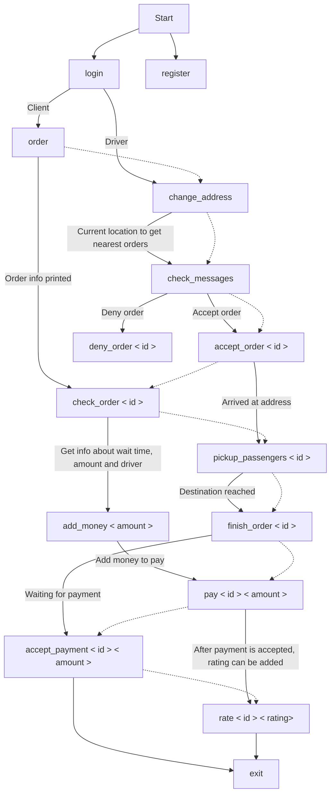

# Uber - term project for OOP course

## Introduction

This is my implementation of the task - a simple taxi service management service.

## Compilation

You can use the provided CMakeLists.txt file if you want to!

## Usage

After compilation just execute it...

## Available commands
```
--------Users--------
register <type> <username> <password> <first name> <last name> <car number> <phone number>
login <username> <password>
logout
change_password <new password>
whoami

--------Order----------
order
check_order <id>
cancel_order <id>
pay <id> <amount>
rate <id> <rating>
add_money <amount>

--------Drivers----------
change_address <name> <x coordinate> <y coordinate>
check_messages
accept_order <id> <minutes> <amount>
decline_order <id>
pickup_passengers <id>
finish_order <id>
accept_payment <id> <amount>
```

## Example order workflow



###### Solid line indicates sequence of user action, dotted line indicates sequence of actions in time
